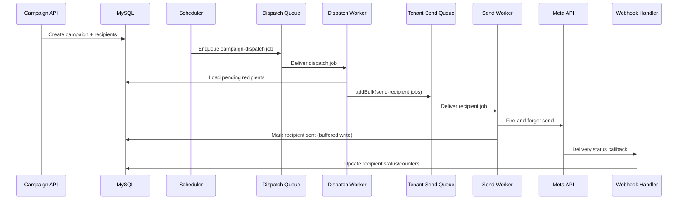

# Campaign System Architecture

## Purpose

This document describes the production campaign execution architecture in the backend.

## High-Level Components

- API Layer
  - `src/models/WhatsappCampaignModel/whatsappcampaign.routes.js`
  - `src/models/WhatsappCampaignModel/whatsappcampaign.controller.js`
  - `src/models/WhatsappCampaignModel/whatsappcampaign.service.js`
- Queue Layer
  - `src/queues/campaignQueue.js`
- Workers
  - `src/workers/campaignDispatchWorker.js`
  - `src/workers/campaignSendWorker.js`
  - `src/workers/dispatchCampaign.js`
- Billing
  - `src/services/campaignBillingService.js`
- Diagnostics
  - `src/services/campaignDiagnostics.service.js`
  - `src/utils/campaignDiagnosticsEvents.js`
- Webhook Status Reconciliation
  - `src/models/AuthWhatsapp/AuthWhatsapp.controller.js`

## Queue Topology

- `campaign-dispatch`
  - Global queue for dispatch page jobs.
- `campaignQueue-{tenant_id}`
  - Per-tenant send queue for recipient-level jobs.
- `campaignDLQ-{tenant_id}`
  - Per-tenant dead-letter queue for exhausted jobs.

## Startup Sequence

1. `initCampaignQueues()` initializes Redis and BullMQ queues.
2. `startCampaignDispatchWorker()` starts the global dispatch worker.
3. `startCampaignSendWorker()` starts tenant send-worker manager.
4. `startCampaignSchedulerService()` starts 1-minute scheduler tick.

## Dispatch Worker Responsibilities

- Pull one dispatch page (`campaign_id`, `tenant_id`, `after_id`).
- Acquire distributed lock in Redis (`campaign:dispatch:{campaign_id}`).
- Load pending recipients using keyset pagination.
- Perform batch billing reservation (except perf-campaign bypass path).
- Enqueue recipient send jobs in bulk via `addBulk`.
- Fan out next page when page is full.
- Confirm or release billing reservation after enqueue.

## Send Worker Responsibilities

- Process one recipient per job.
- Validate recipient and template variables.
- Build template component payload.
- Fire Meta send in fire-and-forget mode.
- Mark recipient as `sent` immediately (batched DB write path).
- On permanent errors, mark `permanently_failed` without retry.
- On retry exhaustion, move job to tenant DLQ and mark recipient permanently failed.

## Error Model

- Permanent errors
  - Validation failures (invalid phone, variable mismatch, missing media, policy blocks).
  - Meta code `131030` is treated as permanent.
- Retryable errors
  - Thrown so BullMQ handles retries with exponential backoff.
- DLQ
  - Failed jobs are pushed to tenant DLQ with sanitized custom job IDs.

## Scheduler and Fallback

- Scheduler ticks every minute.
- Preferred path: enqueue dispatch jobs to BullMQ.
- Fallback path (Redis unavailable): synchronous batch execution via service path.

## Billing Model

- Creation-time wallet check in campaign create flow.
- Dispatch-time atomic reservation in Redis + settlement after enqueue:
  - `createReservation`
  - `confirmReservation`
  - `releaseReservation`
- Perf-campaign bypass path exists in dispatch worker for IDs with `perf_` prefix.

## Webhook Reconciliation

- WhatsApp webhook receives delivery status updates (`sent`, `delivered`, `read`, `failed`).
- Updates campaign recipient status/counters and emits socket updates.
- Campaign event webhook handles campaign engagement events (`open`, `click`).

## Diagnostics Surface

Diagnostics service exposes:

- Due scheduled campaigns.
- Queue health and totals.
- Worker health.
- Redis status.
- Likely failure stage (Redis/DB/Scheduler/Worker/Queue).

## Sequence Diagram

## Data State Transitions

Campaign status:

- `scheduled -> active -> completed`
- `active -> paused -> active`
- `active -> cancelled`
- `active -> failed` (edge condition)

Recipient status:

- `pending -> sent -> delivered -> read`
- `pending -> failed -> pending` (retry path)
- `pending|failed -> permanently_failed`

## Operational Notes

- Fire-and-forget sending increases throughput but depends on webhook reconciliation quality.
- Ensure webhook endpoint health, tenant resolution, and status mapping remain reliable.
- Keep Redis reachable for queue-first architecture. Fallback mode is safe but slower.
